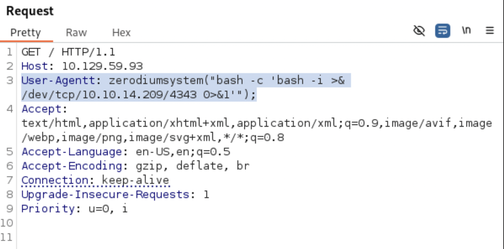

### What I Learned

1. Always check for GTFOBins
2. Looking back this was one of the first CTFs I did, so the writeup is sub par at best

  
<strong>Writeup Summary</strong>

Scan the machine, find a compromised version of PHP. Look up the compromised version and immediately find an exploit. Get a shell on the machine using the exploit or do it yourself using burp.
Run scans on the machine and find a command runnable with root access. Find a gtfobin for that program and get root access. 

 

## Writeup

Scan the machine

Get the version of php running on the machine

- `curl -I http://10.129.59.93`

Find an exploit that works on PHP 8.1.0-dev, but do it yourself so you actually learn
https://flast101.github.io/php-8.1.0-dev-backdoor-rce/

Get a reverse shell and run enumeration commands

- `cat /etc/passwd`
- `cat /etc/fstab`
- `sudo -l`

Find command you can run with root access
/usr/bin/knife

Find a gtfobin for the knife binary running on the machine

- `sudo knife exec -E 'exec "/bin/sh"'`
